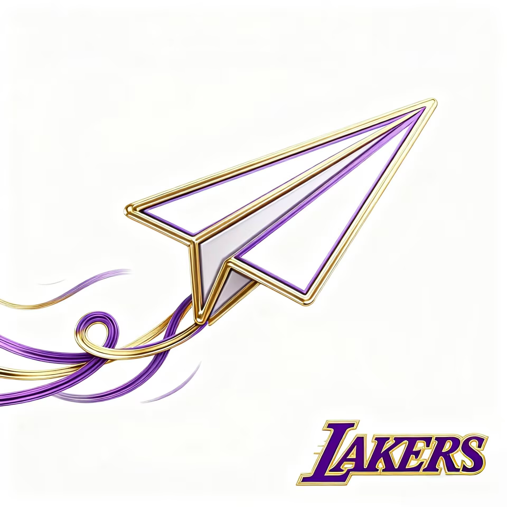

# fzuteam_lakers ovo

> 团队Logo
> 

"哈气后的TA，随风飞行，也许能到达更远的地方。"

> 团队介绍:
> 
>> 这里是 _落山基唬人队_ 的github仓库，用于放置大家的项目，操作文档，需求文档，开发时代码历史版本的保存；我们的宗旨是放松、自由，用热爱不断精进技术，尽力完成好每一个项目。

> 成员介绍
>> 薛刚：
>>兴趣爱好：运动和看电影。
>>技能与经历：c，python，做过cifar101图像识别（图像识别ai模型，代码＋训练），爬虫，数据库，神秘小网页（前端+py后端）。
>>感兴趣的技术方向：开发。
>>未来三年的发展设想：想读研的，因为对科研还剩一点兴趣（；如果有空闲时间我也希望能找人一起或者是自己多做一些项目，因为可以锻炼能力，学习知识。

>> next:阿巴阿巴阿巴

>> nextnext:阿巴阿巴阿巴阿巴